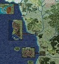

<html>

<b>Check the Bodies Modules</b>

<b>Quest mods for BG2EE EET</b>

The CtB mod originally created by Charles Bisson is a large and vast collection of different quests that are unrelated to each other. Apart from this, it also added a lot of outdated stuff like all the old big mods from the pre-weidu era did. The BG2EE/EET version had become really buggy, far too large and littered with outdated ideas, items and spells. 

The attempt of this series of mods is to make individual quests out of the package available in a modernized way, easy to install, selectable and maintainable for bug fixing.

Some modules require the worldmap mod because they add areas outside the standard map's boundaries. 
- Liberation of Hlondeth https://github.com/RoxanneSHS/Hlondeth
- Drow Library https://github.com/RoxanneSHS/DrowLibrary
- Candlekeep Memories https://github.com/RoxanneSHS/CandlekeepMemories
- Civil Disobedience https://github.com/RoxanneSHS/CivilDisobedience
- Have Ice https://github.com/RoxanneSHS/HaveIce
- Velvetfoot https://github.com/RoxanneSHS/Velvetfoot
- Speak to the Dead https://github.com/RoxanneSHS/SpeakDead
- Of Elves and Artefacts https://github.com/RoxanneSHS/MalteseArtefact
- Melinda the Mute https://github.com/RoxanneSHS/MelyndaMute
- Holly the Elf https://github.com/RoxanneSHS/HollytheElf
- Master Vampire https://github.com/RoxanneSHS/MasterVampire
 
It is recommended to use https://github.com/EE-Mod-Setup/EE-Mod-Setup for mod installation of these modules.
&nbsp;

&nbsp;

</body>

</html>
